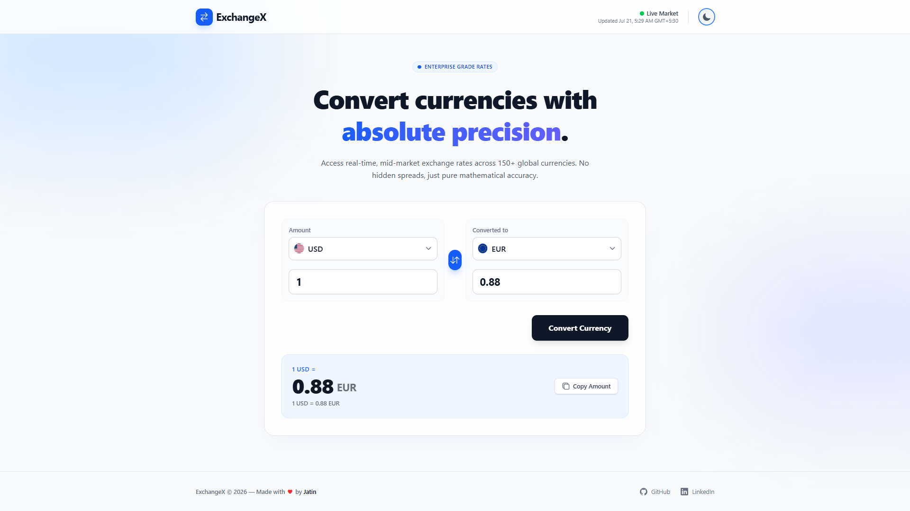
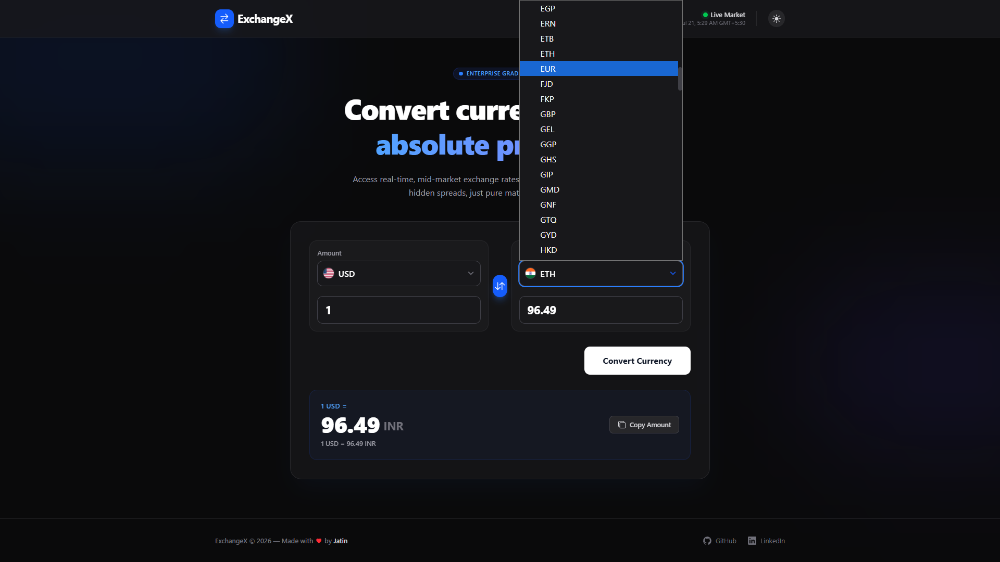
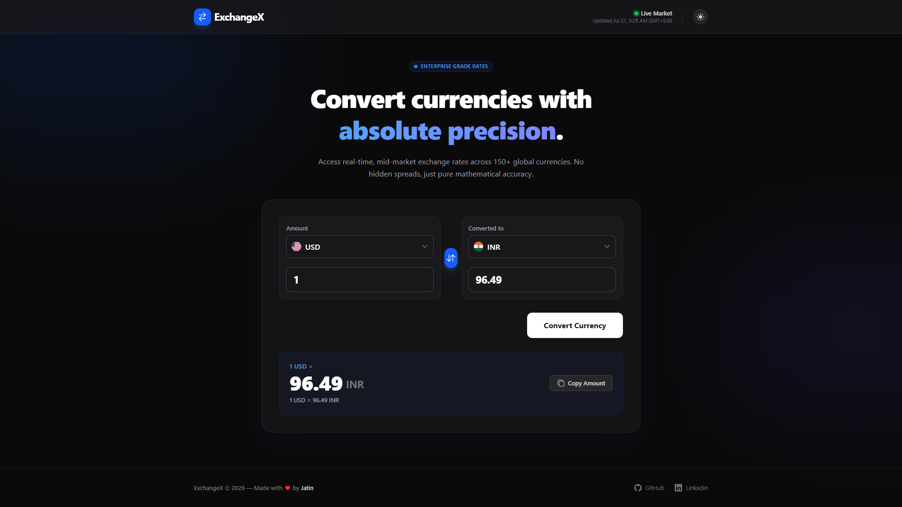
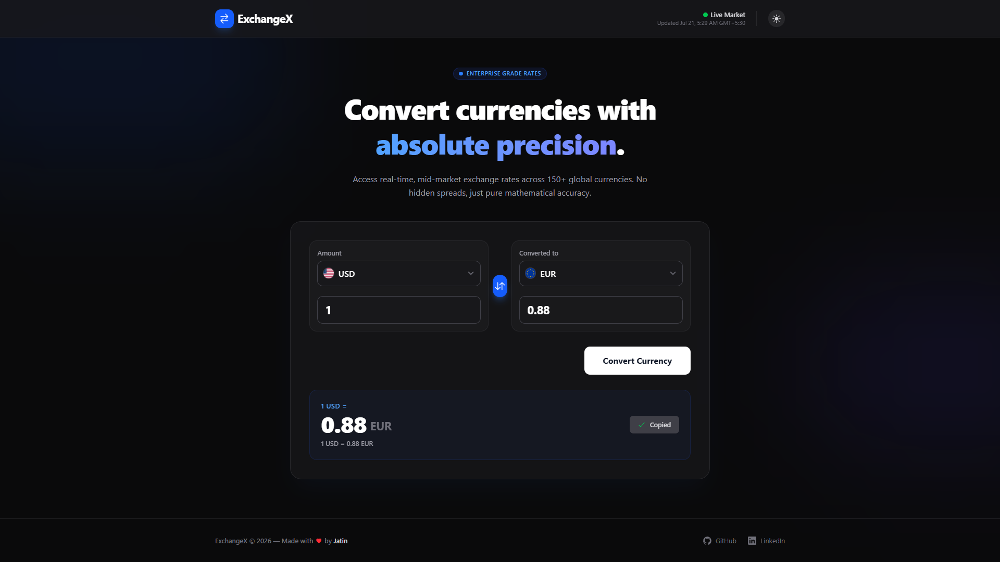

# ExchangeX – Real-Time Currency Dashboard 💱

ExchangeX is a premium, production-ready fintech application engineered with modern React 19. Designed to transcend standard currency converters, it offers a real-time, mathematically precise exchange dashboard inspired by industry leaders like Stripe, Wise, and Revolut.

This project demonstrates advanced frontend architecture, custom React hooks, seamless third-party API integration, and meticulous attention to premium UI/UX details, making it a perfect showcase of enterprise-grade fintech development.

---

## ✨ Key Features

- **Absolute Precision Engine**: An advanced custom hook (`useCurrencyInfo`) that correctly triangulates conversion math using a USD base to ensure flawless cross-currency exchange rates.
- **Dynamic Country Flags**: Instantly fetches and renders perfectly circular country flags corresponding to over 150+ global currency codes.
- **Premium UI/UX**: Designed with Tailwind CSS v4, featuring a breathtaking glassmorphic layout, fluid transitions, rotational micro-interactions, and high-contrast typography.
- **Dark & Light Mode**: A robust, persistent theme switcher utilizing `localStorage` and custom Tailwind CSS variants for a seamless aesthetic toggle.
- **Live Market Status**: Built-in visual network indicators (pulsing green/yellow dots) alongside accurate "Last Updated" timestamps mirroring real trading terminals.
- **One-Click Workflow**: Features a convenient "Copy Amount" clipboard utility utilizing the native browser clipboard API.
- **Fully Responsive**: Flawlessly adapts across all device viewports, breaking from a wide side-by-side dashboard to an intuitive vertical stack on mobile.

---

## 🎨 Project Preview

|                           Dashboard & Overview                            |                              Currency Selection                               |
| :-----------------------------------------------------------------------: | :---------------------------------------------------------------------------: |
|  |  |

|                         Dark Mode Aesthetic                          |                           Copy to Clipboard                            |
| :------------------------------------------------------------------: | :--------------------------------------------------------------------: |
|  |  |

---

## 🚀 Live Demo

[Experience ExchangeX Live](https://exchangexcc.netlify.app/)

---

## 💻 Tech Stack & Architecture

ExchangeX is built using a modern, scalable technology stack chosen for speed, reliability, and developer experience.

| Technology          | Role           | Description                                                                                     |
| :------------------ | :------------- | :---------------------------------------------------------------------------------------------- |
| **React 19**        | Core Framework | Utilizes the latest React hooks and component paradigms for a highly interactive UI.            |
| **Vite**            | Build Tooling  | Delivers lightning-fast HMR and highly optimized production bundles.                            |
| **Tailwind CSS v4** | Styling        | Powers the entire design system using utility classes, CSS variables, and responsive modifiers. |
| **CurrencyAPI**     | Data Layer     | Integrates a live, mid-market foreign exchange API via standard Fetch protocol.                 |
| **React Icons**     | Assets         | Integrates lightweight, scalable vector icons (`Io5`) across the interface.                     |
| **clsx & twMerge**  | Utility        | Ensures complex dynamic class string construction remains conflict-free.                        |

---

## 📁 Scalable Folder Architecture

The codebase is meticulously organized using enterprise-standard patterns to ensure maintainability and strict separation of concerns:

```text
src/
├── components/
│   ├── features/      # Complex logic (ConverterCard, AmountInput, CurrencySelect, SwapButton)
│   ├── layout/        # Structural wrappers (Navbar, Footer)
│   └── ui/            # Reusable primitives (ThemeToggle)
├── constants/         # Static configuration (Currency-to-Country Flag maps)
├── hooks/             # Custom React Hooks (useCurrencyInfo)
├── services/          # Data fetching abstractions (currencyApi)
├── utils/             # Helper functions (Number formatting, Class merging)
├── App.jsx            # Application root and layout assembly
└── main.jsx           # React DOM rendering
```

---

_Made with 💖 by Jatin_
